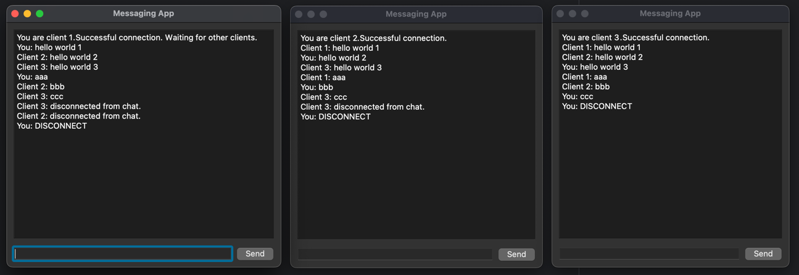

# Client-Server
 
This project represents simple Client-Server chat application. 
Clients are basic window applications, that can send messages and display received messagess from other clients.



The communication between clients and the server is done via python sockets. 

There can be as many client as you want, messaging is done similar to group chat.

## Set up the application
1. Install dependencies
```
cd Client-Server
python -m venv .venv
source .venv/bin.activate
pip install requirements.txt
```
2. Run server
```
python server.py
```
3. Run client

Open new terminal window for every new client
```
cd Client-Server
python client.py
```
## How the application works

All the messages are encrypted via RSA algorithm before sending. Then they are encoded with Run Length Encoding algorithm to compress message.
When server gets the encrypted message, it at first decodes, then decrypts via private key to print the sent message. Then it once more encrypts it, encodes and sends to all connected clients.

There is disconnect message "DISCONNECT". When sending it, the client will be disconnected from the server, and will be removed from the connected clients' list